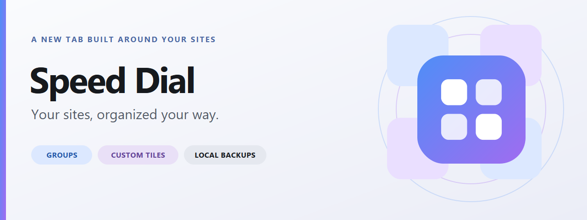
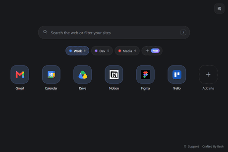
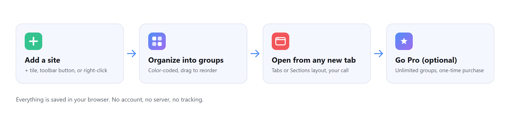
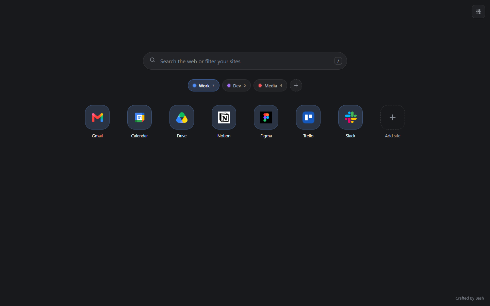
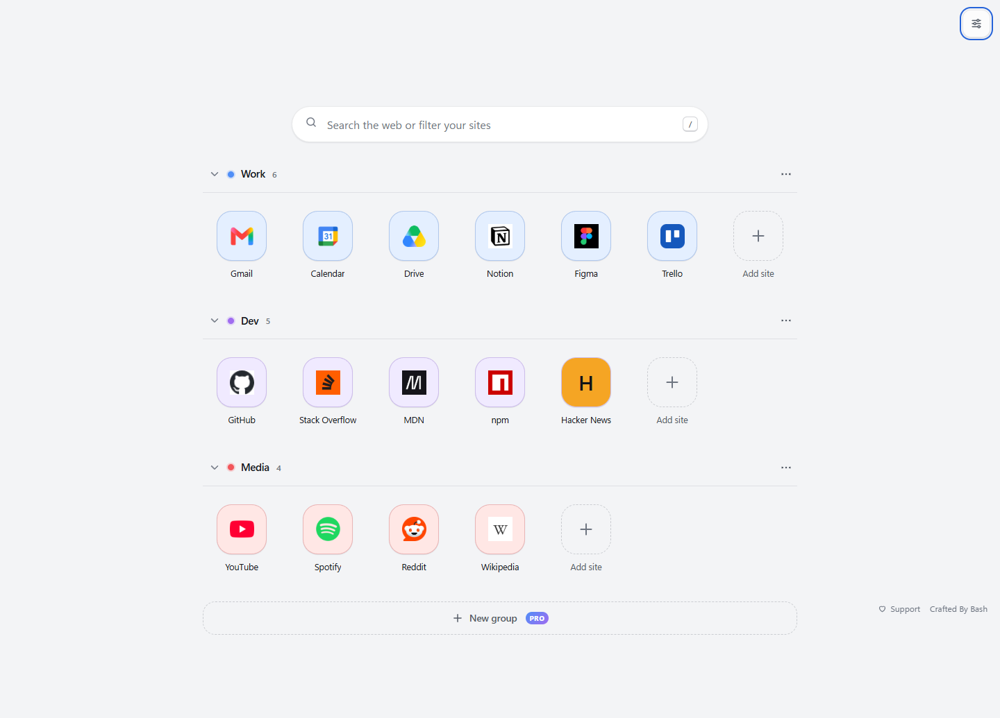
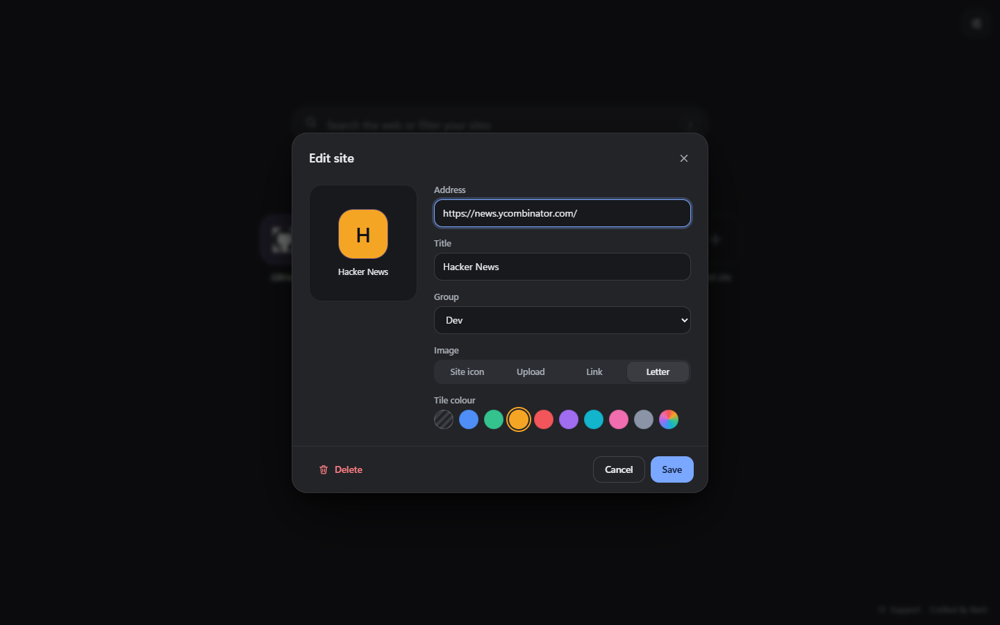
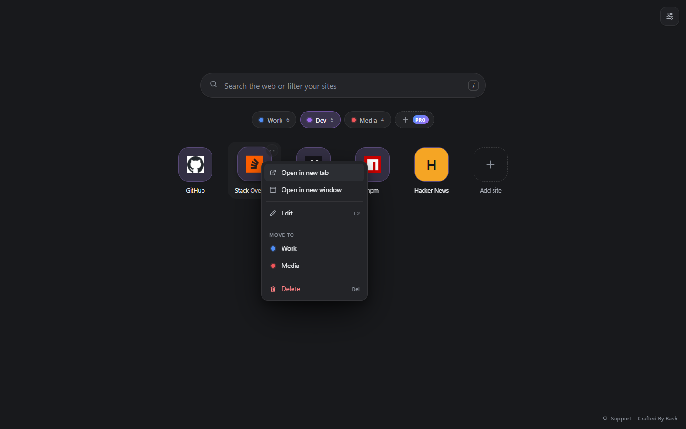
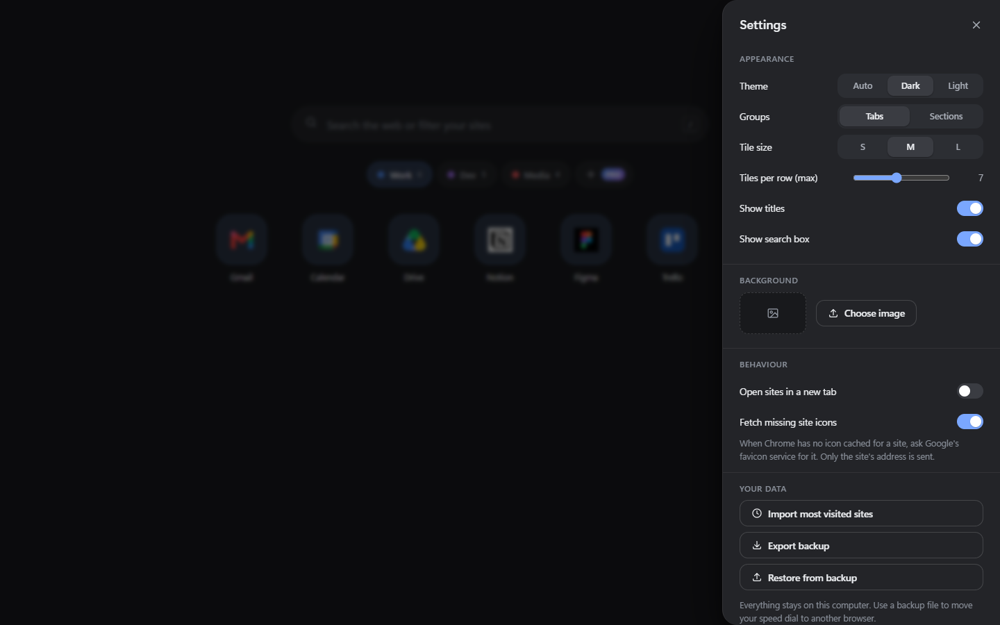
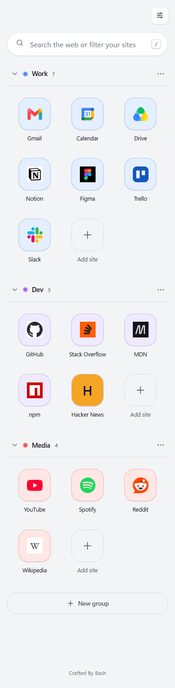

<p align="center">
  <picture>
    <source media="(prefers-color-scheme: dark)" srcset="assets/readme/banner-dark-1280x480.png">
    
  </picture>
</p>

<h1 align="center">Speed Dial</h1>

<p align="center">
  A customizable Chrome new tab for your favorite sites. Organize links into color-coded groups, choose your own tile images, and move your setup with a local backup file.
</p>

<p align="center">
  <a href="https://github.com/supportefy-dev/speed-dial/releases/latest"></a>
  <a href="https://github.com/supportefy-dev/speed-dial/releases"></a>
  
  
  
  <a href="LICENSE"></a>
  <a href="https://paypal.me/BashOM"></a>
</p>

<p align="center">
  <a href="https://github.com/supportefy-dev/speed-dial/releases/latest"><strong>Download the current release</strong></a>
  &nbsp;&middot;&nbsp;
  <a href="#see-it-in-action">See it in action</a>
  &nbsp;&middot;&nbsp;
  <a href="#preview">Preview</a>
  &nbsp;&middot;&nbsp;
  <a href="#speed-dial-pro">Speed Dial Pro</a>
  &nbsp;&middot;&nbsp;
  <a href="PRIVACY.md">Privacy policy</a>
  &nbsp;&middot;&nbsp;
  <a href="https://github.com/supportefy-dev/speed-dial/issues">Report an issue</a>
</p>

> Speed Dial is not in the browser stores yet. Install it from the release ZIP for your browser, below.

## Features

<table>
  <tr>
    <td width="33%" valign="top">
      <br>
      <strong>Groups and layouts</strong><br>
      <sub>Color-coded groups shown as tabs or as collapsible sections; drag to reorder.</sub>
    </td>
    <td width="33%" valign="top">
      <br>
      <strong>Custom tiles</strong><br>
      <sub>Set each tile's title, address, color and image: site icon, upload, link or letter.</sub>
    </td>
    <td width="33%" valign="top">
      <br>
      <strong>Quick add</strong><br>
      <sub>The + tile, toolbar button, right-click menu, or a link dragged onto the grid.</sub>
    </td>
  </tr>
  <tr>
    <td width="33%" valign="top">
      <br>
      <strong>Search</strong><br>
      <sub>Type to filter your saved sites; press Enter to search the web instead.</sub>
    </td>
    <td width="33%" valign="top">
      <br>
      <strong>Local backups</strong><br>
      <sub>Export everything to a file and restore it later; deletes and restores can be undone.</sub>
    </td>
    <td width="33%" valign="top">
      <br>
      <strong>Pro and early bird</strong><br>
      <sub>Unlimited groups with a one-time Pro purchase, or free forever for the first 100 users.</sub>
    </td>
  </tr>
</table>

## See it in action

<p align="center">
  
</p>

<sub>Recorded from the real extension with sample groups and sites; no personal data.</sub>

## How it works

<picture>
  <source media="(prefers-color-scheme: dark)" srcset="assets/readme/how-it-works-dark.png">
  
</picture>

## Browser support

<table>
  <tr>
    <td align="center" width="14%"><br><strong>Chrome</strong></td>
    <td align="center" width="14%"><br><strong>Edge</strong></td>
    <td align="center" width="14%"><br><strong>Brave</strong></td>
    <td align="center" width="14%"><br><strong>Opera</strong></td>
    <td align="center" width="14%"><br><strong>Vivaldi</strong></td>
    <td align="center" width="14%"><br><strong>Firefox</strong></td>
    <td align="center" width="14%"><br><strong>Safari</strong></td>
  </tr>
  <tr>
    <td align="center">Supported<br><sub>116+</sub></td>
    <td align="center">Supported<br><sub>tested 154</sub></td>
    <td align="center">Expected<br><sub>not tested</sub></td>
    <td align="center">Toolbar only<br><sub>no new tab</sub></td>
    <td align="center">Works<br><sub>allow in settings</sub></td>
    <td align="center">Preview<br><sub>128+</sub></td>
    <td align="center">Not supported<br><sub>not yet</sub></td>
  </tr>
</table>

- **Chrome and Edge** were tested with the extension loaded: the full test suite passes in Chromium, the open-source engine Chrome is built on, and in Edge 154. Install from the extensions page with **Developer mode** on, using the chromium ZIP.
- **Brave** uses the same Chromium engine and should work; **Import most visited sites** may find nothing, because Brave turns that data off. Please [report](https://github.com/supportefy-dev/speed-dial/issues) what you find.
- **Opera and Arc** do not let extensions replace the new tab (Opera keeps its own Speed Dial). Open Speed Dial from the toolbar button and pin the tab.
- **Vivaldi** needs the extension's new tab allowed in Vivaldi's settings; the toolbar button always works.
- **Firefox** uses its own ZIP (preview): it installs and opens in Firefox 155, and the full test pass is pending. Site icons come from the online icon lookup, because Firefox has no icon cache for extensions.
- **Safari** needs an Apple-signed app wrapper, so it is not available yet.
- **Mobile browsers** are not supported: Chrome on Android and iOS has no extension support.

## Install

Download the ZIP for your browser from the [latest release](https://github.com/supportefy-dev/speed-dial/releases/latest) and unzip it to a folder you will keep; the browser loads the extension from that folder.

### Chrome, Edge, Brave, Vivaldi, Opera, Arc

1. Use `speed-dial-<version>-chromium.zip`.
2. Open the extensions page (`chrome://extensions`, `edge://extensions`, `brave://extensions`, and so on) and switch on **Developer mode**.
3. Click **Load unpacked** and select the unzipped folder that contains `manifest.json`.
4. Open a new tab. When the browser asks whether to keep the changed new tab page, choose **Keep it**.

To update, unzip the new release over the old folder and press the reload icon on the Speed Dial card.

### Firefox (preview)

1. Use `speed-dial-<version>-firefox.zip`.
2. Open `about:debugging`, choose **This Firefox**, then **Load Temporary Add-on**, and pick the ZIP file.
3. Open a new tab.

Firefox removes temporary add-ons when it restarts. A permanent Firefox install needs the add-on to be signed by Mozilla, which will come with the addons.mozilla.org listing.

### From source

```bash
git clone https://github.com/supportefy-dev/speed-dial.git
python tools/build.py
```

`tools/build.py` writes `dist/chromium/` and `dist/firefox/`; load the folder for your browser as above. The repository root itself also loads as-is in Chrome and Edge.

## Preview

| Tabs, dark theme | Sections, light theme |
|---|---|
|  |  |

<details>
<summary>More screenshots: tile editor, tile menu, settings, narrow window</summary>

| Tile editor | Tile menu |
|---|---|
|  |  |

| Settings | Narrow window |
|---|---|
|  |  |

</details>

## How to use it

| To | Do this |
|---|---|
| Add a site | Click the dashed **+** tile, use the toolbar button, right-click a page or link, or drag a link onto the grid |
| Edit a site | Hover it and click **...**, right-click it, or focus it and press `F2` |
| Change a tile's picture | Edit the site and pick **Site icon**, **Upload**, **Link** or **Letter**, or drop an image file onto the tile |
| Reorder sites | Drag them, or press `Alt + Left/Right` on the focused tile |
| Move a site to another group | Drag it onto the group's tab (hover to open the group and drop it in place), or use **Move to** in its menu |
| Create a group | The **+** after the group tabs, or **New group** at the bottom of the Sections layout |
| Rename or recolor a group | Double-click its tab, or right-click and choose **Edit group** |
| Reorder groups | Drag the group tabs, or drag the section headers in the Sections layout |
| Search | Typing filters your saved sites across all groups; `Enter` searches the web with your default search engine |
| Change layout, theme, sizes, background | Open **Settings** (top right) |
| Undo | Click **Undo** on the notice at the bottom of the page |

> Chrome does not let extensions read the shortcuts on Google's own new tab page. Use **Settings > Import most visited sites**, or click the toolbar button on each site you want to keep.

## Speed Dial Pro

Speed Dial is free, and the free tier keeps every feature in the extension, with up to 3 groups. Creating a 4th group is the only thing that asks for Pro; groups you already have are never removed or locked. Speed Dial Pro is a **one-time purchase**: **$3.99 USD**, with a **launch price of $2.99** until **2026-10-31**.

> **Early bird:** Pro is free forever for the first 100 users. Email [bash@supportefy.com](mailto:bash@supportefy.com?subject=Speed%20Dial%20early%20bird%20key) with the subject "Speed Dial early bird key" to claim your key. It includes every future Pro feature.

**Pro unlocks today:**

- Unlimited groups.

**Coming to Pro at no extra cost** (planned, not shipped yet):

- Sync across computers.
- Automatic backups.
- Bookmark-folder groups.
- Private, PIN-hidden groups.
- A style pack: extra themes, rotating backgrounds and a clock.

### Buying and activating

1. Open **Settings > Speed Dial Pro > Get Speed Dial Pro** (it also opens when you create a 4th group), then click **Buy with PayPal**.
2. After payment, your license key is emailed to your PayPal address. Early-bird keys arrive by email the same way.
3. Paste the key under **Already have a license key?** and click **Activate**.

The license key is verified on your device with a digital signature; there is no account and no network call to check it. Only the PayPal checkout itself talks to PayPal's servers.

## Privacy and permissions

Speed Dial has no account, no analytics and no server of its own. Your groups, tiles, uploaded images, background and settings are saved in the browser (`chrome.storage.local`). A few actions do reach other services:

- **Missing site icons.** When Chrome has no icon cached for a site and **Settings > Fetch missing site icons** is on, the site's origin (for example `https://example.com`) is sent to Google's favicon service. Turn it off and those tiles show a letter.
- **Image links.** A tile that uses an image link loads that image from its host.
- **Search.** Pressing `Enter` in the search box sends the text to your default search engine.
- **Backups.** Exported backup files are saved where you choose; they contain your tiles, uploaded images and background.
- **Speed Dial Pro.** Your license key is stored locally and verified offline; buying a license happens on PayPal's own site, under PayPal's privacy terms.

The full policy is in [PRIVACY.md](PRIVACY.md).

| Permission | Why it is needed |
|---|---|
| `storage`, `unlimitedStorage` | Save your groups, tiles, uploaded images, background and Pro license |
| `favicon` | Read site icons from Chrome's local cache |
| `topSites` | Import your most visited sites, only when you ask |
| `search` | Send the search box to your default search engine |
| `contextMenus` | The **Add to Speed Dial** right-click entries |
| `activeTab` | Read the current page's address and title when you click the toolbar button |

Speed Dial requests no host permissions and never reads the content of the pages you visit.

## Keyboard shortcuts

| Keys | Action |
|---|---|
| `/` | Focus the search box |
| Arrow keys | Move between tiles |
| `Enter` | Open the focused site (or search the web from the search box) |
| `Ctrl + Enter`, middle click | Open in a background tab |
| `Shift + Enter` | Open in a new window |
| `F2` | Edit the focused site or group |
| `Delete` | Delete the focused site |
| `Alt + Left/Right` | Move the focused site |
| `Shift + F10` | Open the options menu |
| `Esc` | Clear the search, or close a menu or dialog |

## Development

The project uses plain ES modules with no runtime dependencies. In Chrome or Edge, load the repository folder directly with **Load unpacked**, edit a file, then reload the extension card to see the change. `python tools/build.py` produces the per-browser packages (`dist/chromium`, `dist/firefox`) and their ZIPs; the Firefox manifest is generated from `manifest.json`, so edit only the root manifest.

Run the static checks before submitting a change:

```powershell
Get-ChildItem src\*.js | ForEach-Object { node --check $_.FullName }
Get-Content -Raw manifest.json | ConvertFrom-Json | Out-Null
```

For interface changes, manually verify:

1. Add, edit and delete a tile, including each image type (site icon, upload, link, letter).
2. Drag and drop for tiles, groups, bookmark-bar links and dropped image files.
3. Create, rename, recolor, reorder and delete a group in both the Tabs and Sections layouts.
4. Search, and `Enter` to fall through to the default search engine.
5. Export a backup, then restore it, then undo the restore.
6. Theme, layout, tile size and background changes in Settings.
7. If the change touches groups or licensing: the 3-group free limit, and activating and removing a Pro license key.

Strings live in `_locales/en/messages.json`. To translate, add `_locales/<language>/messages.json` with the same keys. Sizes, colors, timings and limits live in `src/config.js`; visual tokens live at the top of `src/newtab.css`. `python tools/make_icons.py` redraws the icons in `icons/` (needs Pillow). Store and README artwork, with editable SVG sources and listing copy, is in [`assets/media-pack/`](assets/media-pack/README.md); the README-only artwork (dark banner, feature icons, how-it-works diagram, demo GIF) and the scripts that rebuild it are in [`tools/readme-media/`](tools/readme-media/README.md).

<details>
<summary>Project structure</summary>

```
manifest.json            Extension manifest (MV3)
_locales/en/             Every user-facing string
icons/                   Toolbar and store icons
assets/media-pack/       Store, README and social artwork plus sources
assets/readme/           README-only artwork built by tools/readme-media/
docs/screenshots/        Images used in this README
tools/make_icons.py      Regenerates icons/
tools/readme-media/      Scripts that rebuild assets/readme/
src/
  newtab.html/.css       The new tab page and its design tokens (light and dark)
  app.js                 Rendering, events and keyboard handling for the new tab page
  store.js               State, validation, persistence and cross-tab sync
  actions.js             Every change a user can make, with undo
  dialogs.js             Site editor, group editor and settings sheet
  dnd.js                 Drag and drop for tiles, groups, links and image files
  tiles.js               Tile rendering and the icon fallback chain
  favicon.js             Chrome favicon cache, remote icon lookup, generic-icon detection
  menu.js, toast.js      Context menu and undo notices
  credits.js             Credit, version and support links
  license.js             Speed Dial Pro license verification and the free-tier group limit
  popup.html/.js/.css    Toolbar popup for adding the current page
  background.js          Service worker: right-click menu entries and first-run setup
  config.js              Every tunable value in one place
```

</details>

## Source rights

Copyright (c) 2026 Supportefy LLC. All rights reserved.

This repository does not grant an open-source license (see [LICENSE](LICENSE)). The installation steps above are for using the extension; copying, modifying, redistributing or commercializing the source requires prior written permission from Supportefy LLC. A Speed Dial Pro key grants a personal right to use the Pro features, not rights to the source. Licensing terms may change later.

## Credits

**Crafted By Bash.** The credit also appears in the extension: on the new tab page, in the Settings panel and in the toolbar popup.

## Support development

Speed Dial's free tier is free to use, and a Speed Dial Pro purchase is separate from this: if the extension is useful to you, you can also [make a one-time donation on PayPal](https://paypal.me/BashOM). Donations are optional and do not unlock anything.

You can also help by [reporting a bug](https://github.com/supportefy-dev/speed-dial/issues) or sharing the project. Read [`CONTRIBUTING.md`](CONTRIBUTING.md) before opening a pull request.

---

<p align="center"><sub>Speed Dial 1.2.1 &middot; Crafted By Bash &middot; Copyright (c) 2026 Supportefy LLC</sub></p>
